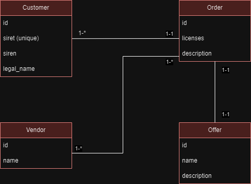

## Logical data model for this project 

## Backend Documentation

- To create tables and establish relationships, I utilized Laravel Migrations.
- I used Seeders to insert default values for Offers, and Vendors 
- I used Eloquent to directly interact with the database.
- To segregate logic and model persistence, I employed the Repository Pattern.
- For validating entry points, I utilized Requests.
- To define the structure of the returned API, I employed Laravel Resources.

## How to run project : 

    git clone <Url>
    Go to the folder application using cd command on your cmd or terminal
    Run composer install on your cmd or terminal
    Copy .env.example file to .env on the root folder. You can type copy .env.example .env 
    Open your .env file and change the database name (DB_DATABASE) to whatever you have, username (DB_USERNAME) and password (DB_PASSWORD) field correspond to your configuration.
    Run php artisan key:generate to generate application key
    Run php artisan migrate to store the tables in bd 
    Run php artisan db:seed to add the list of vendors and offers 
    Run php artisan route:list to see all routes api

## API Documentation

To test my API, you can use Postman and copy/paste this code:

- [Get Customers] : Method Get http://fastsoc-backend.test/api .
- [Add Customers] : Method Post http://fastsoc-backend.test/api/customers, body :  
    {
            "siret": "12321",
            "siren": "22",
            "legal_name": "dsfqsdfqdsf"
    }
- [Update Customers] : Method Put http://fastsoc-backend.test/api/customers/{id}  with body :
    {
            "siret": "xxx",
            "siren": "xxx",
            "legal_name": "xxxx"
    }

- [get Customer] : Method Put http://fastsoc-backend.test/api/customers/{id}  

- [delete Customer] : Method delete http://fastsoc-backend.test/api/customers/{id} 

- [Get Orders] : Method Get http://fastsoc-backend.test/api/orders .

- [Add Orders] : Method Post http://fastsoc-backend.test/api/orders . body : 
{
            "customer_id": 1,
            "vendor_id": [1,2],
            "offer_id": 1,
            "licenses" : 4, 
            "description" : "test2"
}

- [Search for the name of customer] : Method Get http://fastsoc-backend.test/api/client/{siren} | example  : http://fastsoc-backend.test/api/client/380542035: 